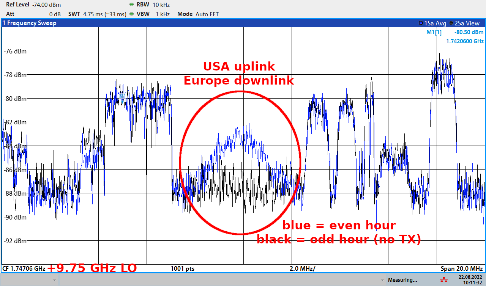
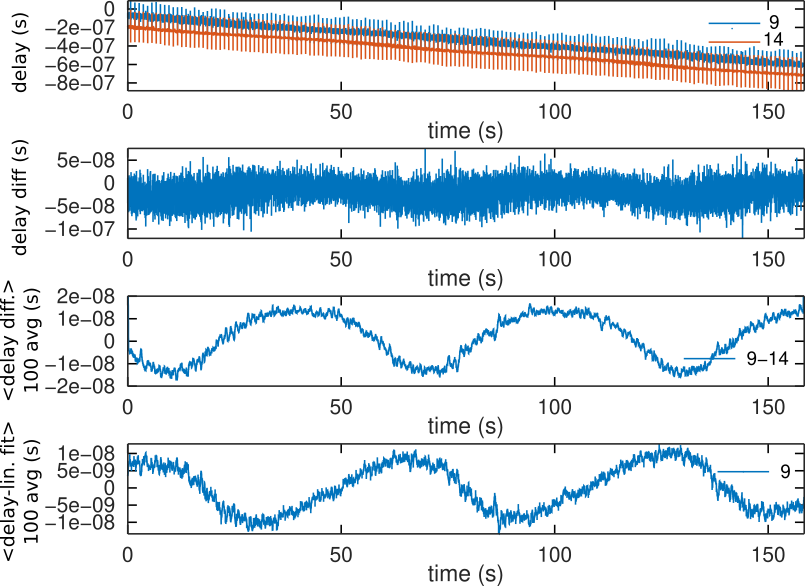
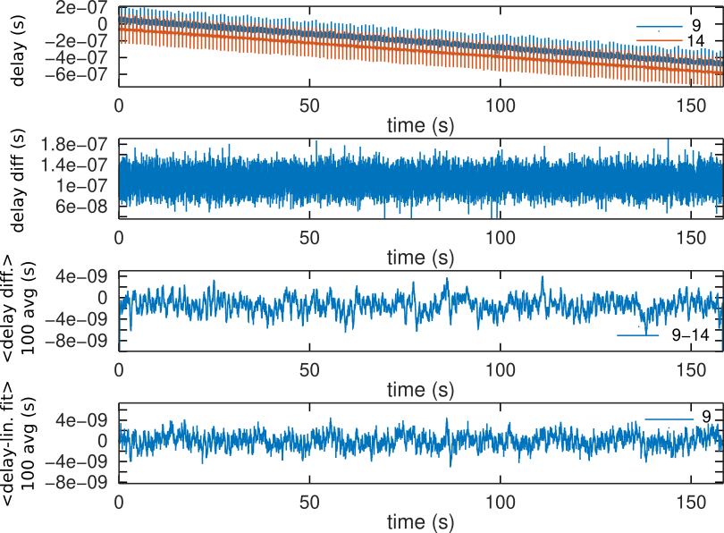

# gr-satre
SATRE modem Two Way Satellite Time and Frequency Transfer receiver implemented as a GNU Radio processing block. The SATRE is a proprietary hardware sold by TimeTech but based on the MITREX microwave two-way satellite time transfer modem developed at Univ. of Stuttgart in the 1980s: most information concerning the CDMA and transmitted codes are collected from the open litterature describing the latter (see bibliography/ directory). TimeTech has added a digital communication layer that is not understood yet, since the current investigations focuses on reception for time transfer only.

## Dataset

Two large (~100 MB) files have been recorded using either a B210 or an X310 Ettus Research SDR receiver, the former set to a 50 dB gain on the AD9361 front end tuned for frequency transposition of the 70 MHz intermediate frequency output of the TX and RX monitor of a SATRE modem, the latter fitted with a two BasicRX frontends (no gain), the RX monitor channel being fitted with a single Agilent MSA886 monolithic amplifier. Both datasets store short integer (16-bit) data, interleaved complex, interleaved TX and RX channels. Notice that due to a connection mistake, RX and TX have been swapped between the two datasets. The sampling rate is 5 MS/s, so that 100 MB files will hold 100(MB)/5(MS/s)/2(complex)/2(short int)/2(channels)=2.5 s worth of data.

## Processing and file description

A detailed description of the SATRE, and its predecessor the MITREX modem, encoding is found
in Appendix 2 of G. De Jong & al, "Results of the calibration of the delays of Earth stations for
TWSTFT using the VSL satellite simulator method", 27th PTTI (1995) at 
https://apps.dtic.mil/sti/pdfs/ADA518490.pdf

1. Start by checking that a signal has been recorded and the coarse frequency offset by
squaring the BPSK modulated signal for getting rid of the spectrum spreading by the modulation
and collapsing the energy in each carrier

2. Check the code length by autocorrelating the signal and verifying that the code length
is 10000 bits at a rate of 2.5 Mchips/s or a Pulse Repetition Interval of 4 ms

3. The ``identify_delay.m`` script is the most important for identifying delays between received
stations. Here we start by correlating the frequency shifted signal with the pseudo-random sequence.
Which code is associated with which frequency shift has been identified by exaustive search as 
described in the ``./reverse_code`` subdirectory, although the list of frequency offsets for each 
station can be found in A. Kanj, "Etude et développement de la méthode TWSTFT phase pour des comparaisons 
hautes performances d’étalons primaires de fréquence" [in French] (2013) at
https://tel.archives-ouvertes.fr/tel-00831596/document on page 54 (table 2.2) 

The frequency offset only needs to be corrected by less than the inverse of the code duration, or
4 ms at a rate of 2.5 Mchips/s and a code length of 10000 chips. Hence, an initial coarse frequency
offset was found by squaring the signal with a resolution of 5 MS/s/N=131072=38 Hz which is much less 
than the required 250 Hz, and after an initial correlation sequence identification the phase of the
correlation is unwrapped for fine frequency offset identification to be used as long as this offset
is not larger than 1 Hz. The ``frequency_residue`` variable in ``identify_delay.m`` checks that the
frequency offset does not diverge during processing.

4. Following fine frequency correction, each correlation peak every 4 ms is fitted with a parabola
for oversampling and fine tuning the correlation delay with an improved time resolution equal to the
measurement signal to noise ratio

We display on top-left the correlation delay after oversampling -- exhibiting the sharp jump by
half a chip period every beginning of a second -- and on bottom the station correlation delay
subtracted from the Paris Observatory clock correlation delay. Top right is the phase after unwrapping
the squared signal phase exhibiting the BPSK digital communication signal, and bottom right is
the sentences reshaped with the sentence length of 250 bits to try and find some pattern in the bit
sequence.

5. The same result is achived for ranging using ``identify_range.m``, this time comparing the
transmitted signal and the received signal (assumes one has access to the SATRE emitter for recording
the TX Monitor signal)

The standard deviation ``stdval`` on the time delay resulting from analyzing this 2.5-s long sequence is 5 to 10 ns
depending on the recorded signal signal to noise ratio.

## Receiving the US-Europe signal

All satellite link information are documented in the files stored by [BIPM](https://webtai.bipm.org/ftp/pub/tai/data/2022/time_transfer/twstft//). Looking at OP records, the downlink frequency for communications within
Europe is 10953.9500 MHz while downlink from the US uplink is 11497.0600 MHz. The latter is verified in
the following measurement taken from a TV satellite reception parabola dish with the LNB local oscillator
set to 9.75 GHz.

From the USNO and NIST files, it can be assumed that the USA downlink frequency is 11747.7400 MHz although
this link has not been verified experimentally (lacking a parabola dish pointed towards Telstar11N located
in the USA).

## On the need for oversampling

The SATRE modulation is BPSK at 2.5 Mchips/s so that sampling at 5 MHz is sufficient for collecting
all the information transfered over the communication channel. However at 5 MHz, the sampling period
is only 200 ns and the time resolution of the correlation output is insufficient. A [classical solution](http://jmfriedt.free.fr/interrogateur.pdf)
is oversampling the correlation peak with a parabolic fit to identify finely the time of flight. Running
this algorithm on the data sampled at 5 MHz leads to periodic fluctuations whenever the correlation
peak switches from one sampling interval to the next:

Quite surprisingly, interpolating the data (ie not adding any information since interpolation involves zero-padding
the Fourier transform of the signal and the code product prior to calculating the inverse Fourier transform
to recover the correlation in the time domain
$$xcorr(x,y)=iFFT(FFT(x)\cdot FFT^*(y) \Rightarrow ifft(fftshift([zeros(N,1) ; fftshift(fft(x))\cdot conj(fftshift(fft(y))) ; zeros(N,1)]))$$
) removes such an artifact:

## Digital mode decoding

The SATRE manual mentions communicating "via HiRate data all necessary information to enable calculation of the predicted arrival of time (PAT) at the satellite by remote modems receiving the 
ranging signal" and goes on describing the time of flight compensation formula.

The only information about HiRate is that Besancon Observatory identifier is 727 as displayed on the 
SATRE modem screen.

Having identified that HiRate is envoded at 250 bps using BPSK, it is quite natural to assume
differential encoding to avoid $\pi$ phase rotation of the Costas loop/atan(Q/I) output. The 
differential encoding of 0d727=0b01011010111 is 100111001111 (start with d(0)=1 and iterate with
m(k)={0, 1, 0, 1, 1, 0, 1, 0, 1, 1, 1}, defining  d(k+1)=1 if d(k)==m(k) and  d(k+1)=0
[otherwise](https://www.idc-online.com/technical_references/pdfs/electronic_engineering/Differential_Encoding_and_Decoding.pdf).

The cross correlation of the decoded message with this 100111001111 repeats most often every 250 bits so this
is probably the right track.
