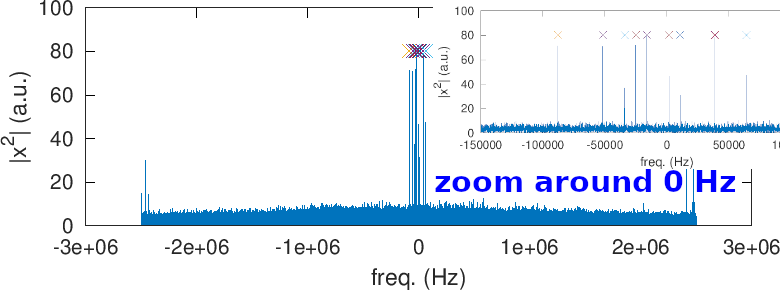
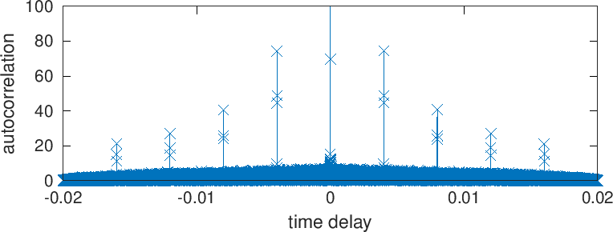
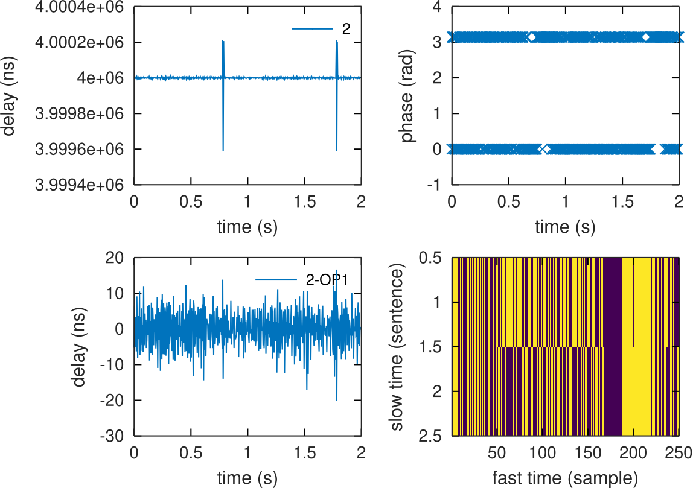
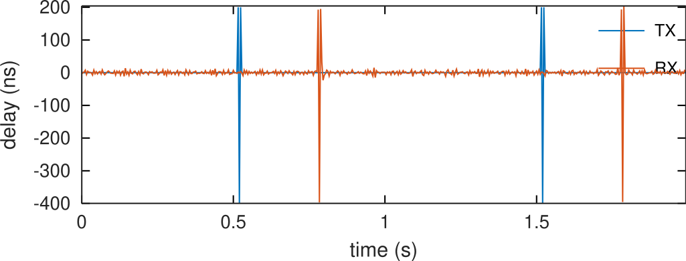
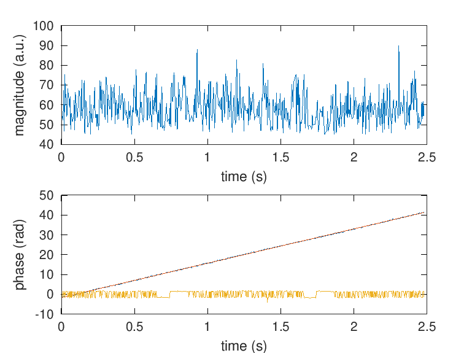
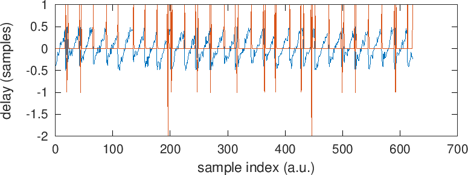
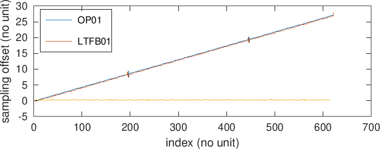

# gr-satre
SATRE modem Two Way Satellite Time and Frequency Transfer receiver implemented as a GNU Radio processing block

A detailed description of the SATRE, and its predecessor the MITREX modem, encoding is found
in Appendix 2 of G. De Jong & al, "Results of the calibration of the delays of Earth stations for
TWSTFT using the VSL satellite simulator method", 27th PTTI (1995) at 
https://apps.dtic.mil/sti/pdfs/ADA518490.pdf

1. Start by checking that a signal has been recorded and the coarse frequency offset by
squaring the BPSK modulated signal for getting rid of the spectrum spreading by the modulation
and collapsing the energy in each carrier

2. Check the code length by autocorrelating the signal and verifying that the code length
is 10000 bits at a rate of 2.5 Mchips/s or a Pulse Repetition Interval of 4 ms

3. Correlate the frequency shifted signal with the pseudo-random sequence, here which code
is associated with which frequency shift has been identified by exaustive search as described
in the ./reverse_code subdirectory, although the
list of frequency offsets for each station can be found in A. Kanj, "Etude et développement de 
la méthode TWSTFT phase pour des comparaisons hautes performances d’étalons primaires de fréquence"
[in French] (2013) at
https://tel.archives-ouvertes.fr/tel-00831596/document on page 54 (table 2.2) 

We display on top the magnitude of the correlation peak -- with some leftover modulation introduced
by the coarse frequency correction -- and on the bottom the phase prior to fine frequency offset
correction, its linear fit for fine frequency offset identification, and the BPSK signal after
fine frequency correction (yellow)

4. Following fine frequency correction, each correlation peak every 4 ms is fitted with a parabola
for oversampling and finding the error in sampling rate

5. The same sequence is applied to a second station for time delay comparison:

6. Finally, the time delay between correlation peaks is displayed, with the absolute delay on
top drifting due to the erroneous (yet common) sampling rate (red and blue) and the difference
(yellow) cancelling the impact of the sampling rate, after removal of a few outliers defined when
above three standard deviations:

The standard deviation on the time delay resulting from analyzing this 2.5-s long sequence is 19 ns.
