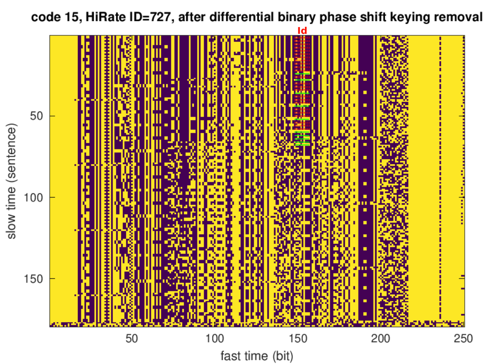
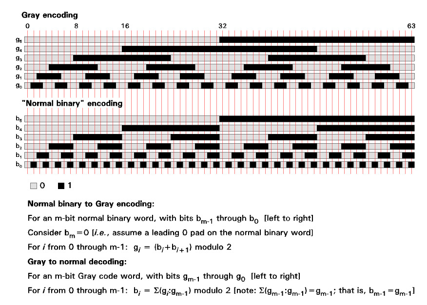
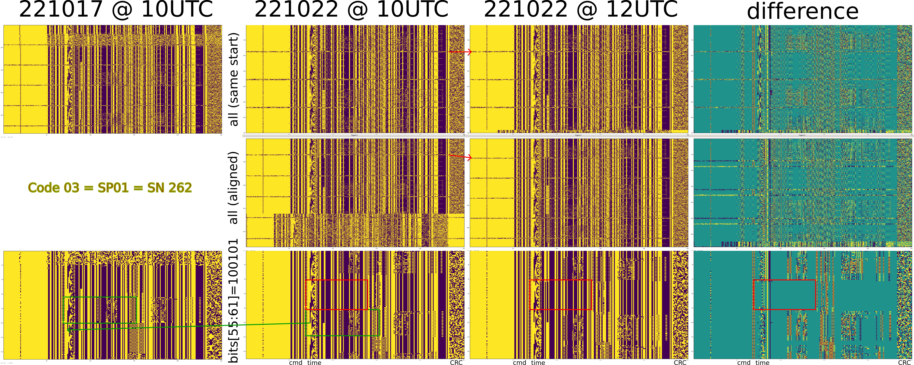
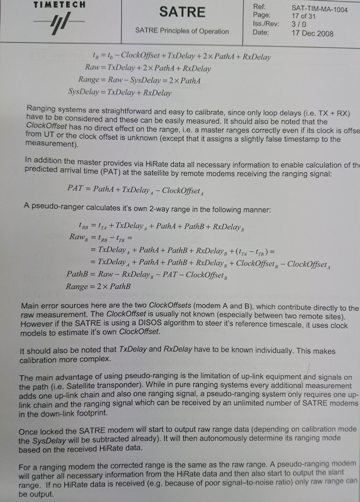
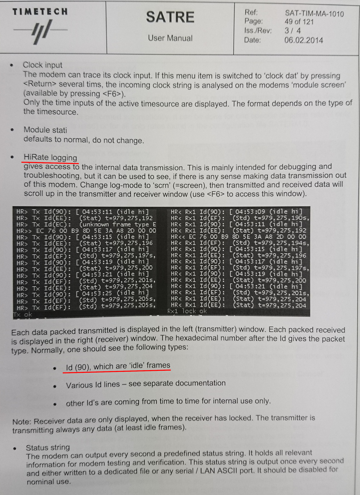

Combined images for showing which bits changed from one acquisition to another:  
```bash
convert hirate09.png hirate09.png hirate15.png -combine combined09_15.jpg
```



A more detailed analysis was performed by starting acquisition at the full hour-5 seconds
to make sure the very beginning of each transmission had been saved, and the acquisition lasted
a bit more than 9 min to make sure the various 3-min long SATRE communication sequences were 
analyzed. The data were collected two hours apart (10h UTC and 12h UTC) on two days separated
by more than a week.

The bits were extracted from computing the phase of the squared signal (phase variation due
to the communication link) and subtracting half the final result from the phase of the signal,
hence cancelling the random phase fluctuations and leaving only the BPSK modulated message. In
addition, it was identified that the signal is most certainly differential BPSK since the absolute
phase is hardly known: differential encoding is classical in such links.

Once the differential BPSK bit map is displayed, still considering a 250 bits/s (i.e. one correlation
every 4 ms which is the duration of the code), the search for patterns shows some seemingly random
16-bit long sequences. We assume this is a CRC since the SATRE User Manual refers (page 23/123) to
"If we encounter a bit error in a data packet by checking the CRC/ECC correction, a CRC is displayed during 
that second.". Identifying the CRC calculation algorithm is work in progress using 
<a href="https://github.com/nitram2342/bruteforce-crc/">a brute force approach</a>.

Nevertheless, once the supposedly 16-bit CRC has been moved at the end of the sentences, a search for a counter
does show multiple columns with 32-bit long, 16-bit long, 8-bit long ... sequences. However they do not
look like a binary counter, although we would expect the second to be transmitted. Actually from the SATRE
User Manual (p. 48/123), we see that the Unix time is displayed, with t=979,275,192 matching Friday, January 12, 2001 
4:53:12 AM and indeed the timestamps on the screenshot indicates 04:53:11. G. Goavec-Merou has identified the
pattern of this "counter" not to be a binary counter (obviously) but Gray coding, see the figure below (from
<a href="https://forum.arduino.cc/t/using-gray-coding-to-read-angular-position-of-a-rotator-need-suitable-sensor/388051">
this Arduino forum discussion."</a>



The missing bits of the Unix time representation still need to be found but at least the pattern is clear, especially
after removing unwanted sentences introduced between those including the time information:



Some pictures of relevant pages of the SATRE User Manual including screenshots of TimeTech's measurements and the principle
of operation:





<h1>CRC analysis</h1>

As described in this <a href="https://hackaday.com/2019/06/27/reverse-engineering-cyclic-redundancy-codes/">Hackaday news</a>, CRC reverse engineering can be tackled using various tools including <a href="https://reveng.sourceforge.io/readme.htm">CRC RevEng</a>. After dumping the bit sequence of one of the modems (SP01 with SN 262 code 3), the result is
```
0000000000000000000100000000000000000000000000000001100101100110010111000011001100111000100111111001011100100110111111011110100110010101110010100100111011010000111001011001011011101111101011110111010001011000110100100000111111111010011001000001011110
0000000000000000000000000000000000000000000000000001100110100110010010000011001001111000100111111001011100100110111111011110100110111100101011110011111010011110111001000001011011101111101011110111010001011000110100100000111111111010001011101010011111
0000000000000000000100000000000000000000000000000001100110100110010111000011001010111000100111111001011100100110111111011110100110111100101000110001101100001110101001000001011011101111101011110111010001011000110100100000111111111010000001100000111100
0000000000000000000000000000000000000000000000000001100101100110010010000011011011111000100111111001011100100110111111011110100110010101110010100100111011010000111001011001011011101111101011110111010001011000110100100000111111111010001111011010001111
0000000000000000000100000000000000000000000000000001100101100110010111000011011000111000100111111001011100100110111111011110100110010101110010100100111011010000111001011001011011101111101011110111010001011000110100100000111111111010010010110111000001
0000000000000000000000000000000000000000000000000001101001100110010010000001100010100011111000101111111001100110111111011110100110010101111001101001000010000101111001000100100101101110111010010111101011001100111000110110010101111010011000101100000110
0000000000000000000100000000000000000000000000000001101001100110010111000001100010100011111000101111111001100110111111011110100110010101111001101001000010000101111001000100100101101110111010010111001001001100111001001110010101111010000001101011001000
0000000000000000000000000000000000000000000000000001100101100110010010000011010111111000100111111001011100100110111111011110100110010101110010100100111011010000111001011001011011101111101011110111010001011000110100100000111111111010011000110111011011
0000000000000000000100000000000000000000000000000001100101100110010111000011010100111000100111111001011100100110111111011110100110010101110010100100111011010000111001011001011011101111101011110111010001011000110100100000111111111010000101011010010101
0000000000000000000000000000000000000000000000000001100110100110010010000011010001111000100111111001011100100110111111011110100110111100101011110011111010011110111001000001011011101111101011110111010001011000110100100000111111111010010111110001010100
```
which after conversion to hexadecimal allows for executing
```reveng -w 16 -s 40000000659970CCE27E5C9BF7A657293B43965BBEBDD163483FE9905E 669920C9E27E5C9BF7A6F2BCFA7B905BBEBDD163483FE8BA9F 40000000669970CAE27E5C9BF7A6F28C6C3A905BBEBDD163483FE8183C 659920DBE27E5C9BF7A657293B43965BBEBDD163483FE8F68F 40000000659970D8E27E5C9BF7A657293B43965BBEBDD163483FE92DC1 699920628F8BF99BF7A6579A42179125BBA5EB338D95E98B06 669920D1E27E5C9BF7A6F2BCFA7B905BBEBDD163483FE97C54 40000000659970D4E27E5C9BF7A657293B43965BBEBDD163483FE85695 659920D7E27E5C9BF7A657293B43965BBEBDD163483FE98DDB
```
which tells us that two solutions match
```
width=16  poly=0x1021  init=0x5684  refin=false  refout=false  xorout=0xce77  check=0x5bf7  residue=0x3b2b  name=(none)
width=16  poly=0x1021  init=0xa69b  refin=false  refout=false  xorout=0x3e68  check=0x5bf7  residue=0xcb34  name=(none)
```
