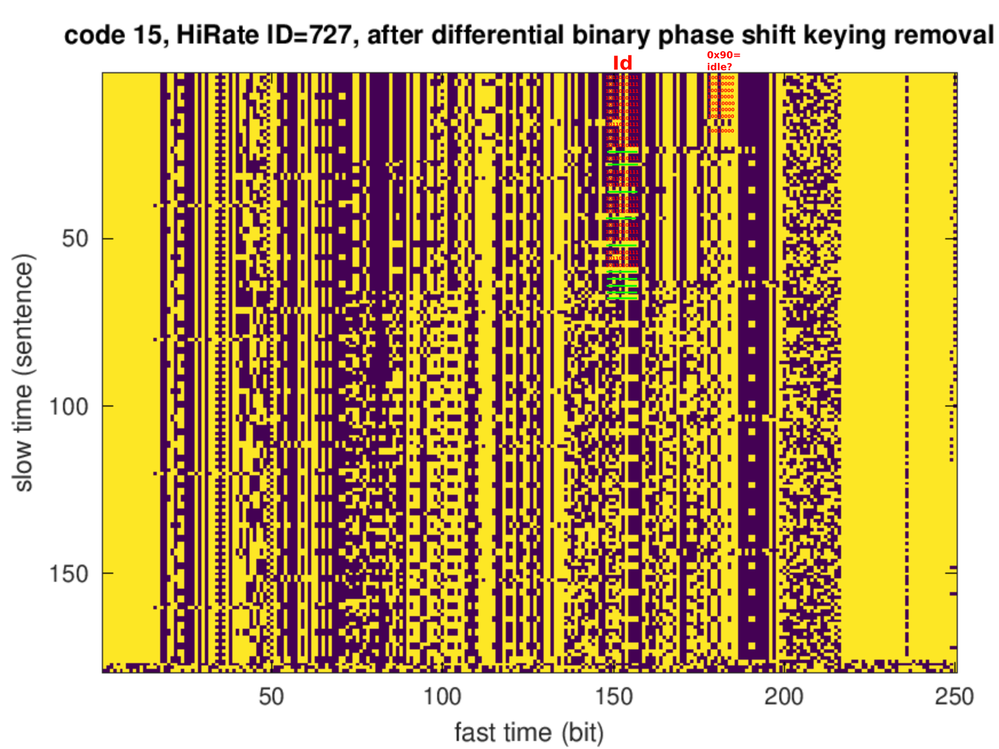

Combined images for showing which bits changed from one acquisition to another:  
```bash
convert hirate09.png hirate09.png hirate15.png -combine combined09_15.jpg
```



A more detailed analysis was performed by starting acquisition at the full hour-5 seconds
to make sure the very beginning of each transmission had been saved, and the acquisition lasted
a bit more than 9 min to make sure the various 3-min long SATRE communication sequences were 
analyzed. The data were collected two hours apart (10h UTC and 12h UTC) on two days separated
by more than a week.

The bits were extracted from computing the phase of the squared signal (phase variation due
to the communication link) and subtracting half the final result from the phase of the signal,
hence cancelling the random phase fluctuations and leaving only the BPSK modulated message. In
addition, it was identified that the signal is most certainly differential BPSK since the absolute
phase is hardly known: differential encoding is classical in such links.

Once the differential BPSK bit map is displayed, still considering a 250 bits/s (i.e. one correlation
every 4 ms which is the duration of the code), the search for patterns shows some seemingly random
16-bit long sequences. We assume this is a CRC since the SATRE User Manual refers (page 23/123) to
"If we encounter a bit error in a data packet by checking the CRC/ECC correction, a CRC is displayed during 
that second.". Identifying the CRC calculation algorithm is work in progress using 
<a href="https://github.com/nitram2342/bruteforce-crc/">a brute force approach</a>.

Nevertheless, once the supposedly 16-bit CRC has been moved at the end of the sentences, a search for a counter
does show multiple columns with 32-bit long, 16-bit long, 8-bit long ... sequences. However they do not
look like a binary counter, although we would expect the second to be transmitted. Actually from the SATRE
User Manual (p. 48/123), we see that the Unix time is displayed, with t=979,275,192 matching Friday, January 12, 2001 
4:53:12 AM and indeed the timestamps on the screenshot indicates 04:53:11. G. Goavec-Merou has identified the
pattern of this "counter" not to be a binary counter (obviously) but Gray coding, see the figure below (from
<a href="https://forum.arduino.cc/t/using-gray-coding-to-read-angular-position-of-a-rotator-need-suitable-sensor/388051">
this Arduino forum discussion."</a>


The missing bits of the Unix time representation still need to be found but at least the pattern is clear, especially
after removing unwanted sentences introduced between those including the time information:


