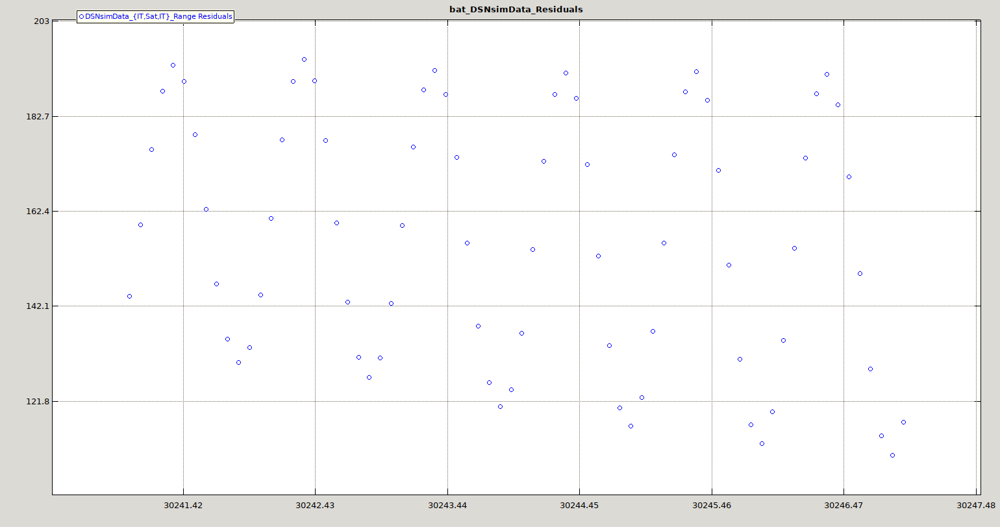
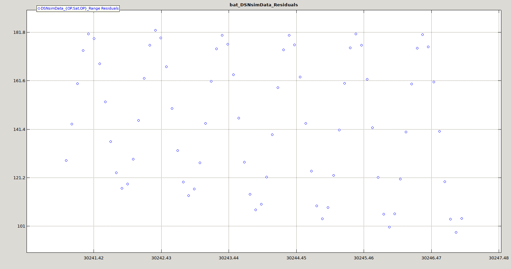
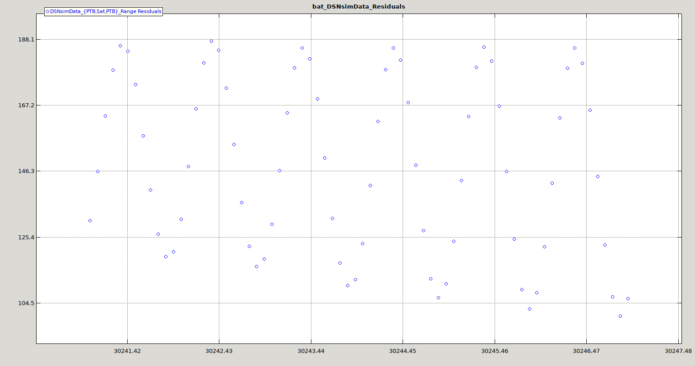
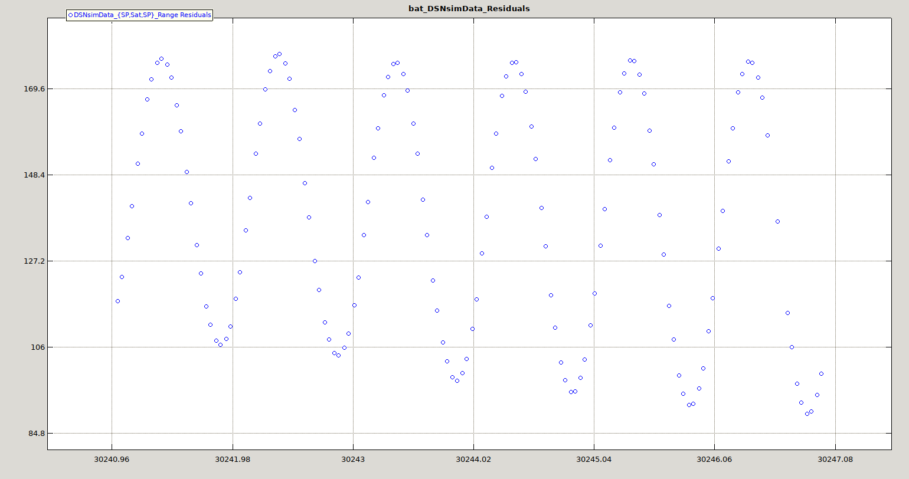
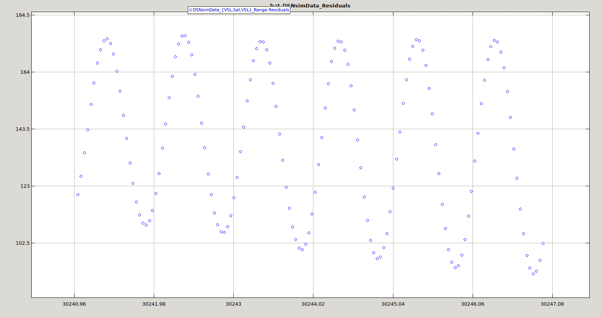
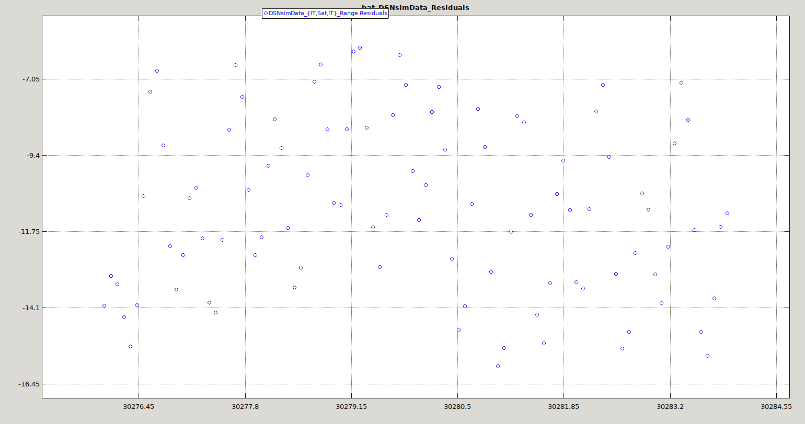
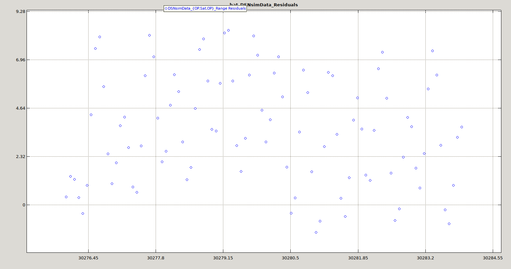
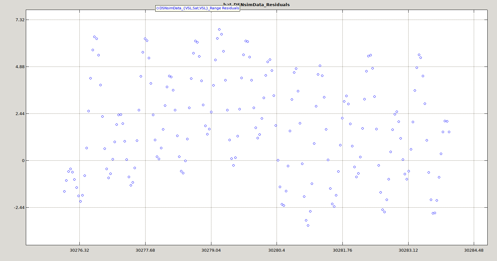

# Geostationary satellite modelling using GMAT

If using Telstar11N relayed TWSTFT for one-way communication to a passive
user, the satellite motion around its equilibrium location by +/-75 us will
significantly degrade the receiver clock synchronization performance.

Unless a station keeping burst to bring the satellite back to its position
occurs, the satellite mechanics is predicted by celestial mechanics as implemented
in e.g. https://www.orekit.org/, https://nyxspace.com/ and https://github.com/nyx-space/anise or here https://software.nasa.gov/software/GSC-17177-1 (GMAT: General Mission Analysis Tool). We are using release 2022 found
on the Sourceforge, pre-build image for Ubuntu LTS running on a VirtualBox. The only
modification made to the GMAT archive content is updating the ``gmat_startup_file.txt`` in the
``bin/`` directory by modifying ``PLUGIN=../plugins/libPythonInterface_py310`` so that
the default Python3.10 can be used and commeting out ``# PLUGIN=../plugins/libMatlabInterface``
to remove Matlab support.

We follow tutorial 14 found in the ``help.html`` file at 
``docs/help/help.html#Orbit_Estimation_using_DSN_Range_and_Doppler_Data``.
This tutorial considers a deep space mission with velocity and position of the spacecraft
observed by the Deep Space Network (DSN) and is found in ``samples/Tut_Orbit_Estimation_using_DSN_Range_and_Doppler_Data.script`` which is the starting point of our 
analysis. We must adapt this script file to our problem using the following steps:

## Ground station location and satellite orbital parameters

With respect to ther original script addressing a deep space network probe, we must 
* replace
the Sun centered framework with an Earth centered framework and replace the Cartesian
coordinate representation of the orbital parameters with a Kepler representation which sounds
more natural for a geostationary satellite. The conversion from NORAD's Two Line Elements
as found at https://www.n2yo.com/satellite/?s=34111 to Kepler parameters is achieved using
https://gist.github.com/kieranshanley/00f80997e4d07501187461d9fc702e7a
to produce
```
GMAT Sat.DateFormat = UTCGregorian;
GMAT Sat.Epoch = '05 Dec 2023 19:53:44.995';
GMAT Sat.CoordinateSystem = EarthMJ2000Eq;
GMAT Sat.DisplayStateType = Keplerian;
GMAT Sat.SMA = 42164.99940414229;
GMAT Sat.ECC = 0.0002514999999993337;
GMAT Sat.INC = 0.01749999999332662;
GMAT Sat.RAAN = 349.7528;
GMAT Sat.AOP = 254.4157000001674;
GMAT Sat.TA = 91.1324142548325;
```
* position the ground station at the appropriate location based on the GPS coordinates found
in each BIPM file header, e.g. https://webtai.bipm.org/ftp/pub/tai/data/2023/time_transfer/twstft/op/twop59.947 stating that
```
* ES   OP01 LA: N  48 50 09.236      LO: E  02 20 05.873   HT:    78.00 m
```
so we define for each ground station a set of fields such as
```
Create GroundStation OP;   
GMAT OP.CentralBody = Earth;
GMAT OP.StateType = Spherical;
GMAT OP.HorizonReference = Ellipsoid;
GMAT OP.Location2 = 2.33496472;
GMAT OP.Location1 = 48.83589880000001;
GMAT OP.Location3 = 0.078;
GMAT OP.Id = '0';
GMAT OP.AddHardware = {DSNTransmitter, DSNAntenna, DSNReceiver};
%OP.IonosphereModel       = 'IRI2007';
GMAT OP.TroposphereModel = 'HopfieldSaastamoinen';
GMAT OP.MinimumElevationAngle = 7;
GMAT OP.ErrorModels = {DSNrange};
```

*Warning: https://documentation.help/GMAT/GroundStation.html is erroneous in stating that
Location1 refers to the Longitude. This is incorrect and the help file in the GMAT archive
found at docs/help/help.html#GroundStation correctly states that Location1 is latitude.* 

* finally the ground station and satellite locations are added to the ground plot with
```
Create GroundTrackPlot DefaultGroundTrackPlot;
GMAT DefaultGroundTrackPlot.Add = {Sat, OP, IT, VSL, PTB, NPL, SP, ROA};
```
* a simulation propagating the satellite position during one day as
```
Propagate DefaultProp(Sat) {Sat.ElapsedSecs = 86400};
```

When executing in the GUI GMAT interface launched by executing in the ``bin/``
directory the executable ``GMAT-R2022a``, loading the ``satre_location.script`` and
executing (right arrow), the resulting charts should look like


Playing the simulation will show that the satellite rotates around the Earth and gets
back to its original location after one day.

Now that we are convinced that satellite parameters are correct (the satellite remains at the
same place with respect to Earth after 1-day) and the ground station locations are accurate,
be go to fine orbit determination using the two-way time transfer observations.

## Orbit determination

After downloading the BIPM TWSTFT archive using
```
wget --recursive --no-parent https://webtai.bipm.org/ftp/pub/tai/data/2023/time_transfer/twstft
```
we produce the GMD file including date in MJD-30000, station name, observable (Range) and
observable type (9002 for two-way spacecraft-ground measurement in km), and measurement by 
multiplying the time of flight with the speed of light
in km/s as found in <a href="go.m">go.m</a>. This is also the file where an index is arbitrarily assigned to
each observatory, matching the definition in the script file: we have selected
OP=0, PTB=1, NPL=2, ROA=3, SP=4, IT=5. The fields including the date as MJD-30000, nature
of the observation (Range) and Observation type index number (9002), station index,
satellite index (99 arbitrarily to match the script definition) and measurement as the
two-way time of flight measurement multiplied by the speed of light in km/s. The resulting
file <a href="satre.gmd">satre.gmd</a> starts with
```
29947.006238 Range 9002 0 99 78717.485944
29947.006238 Range 9002 1 99 80017.802697
29947.006238 Range 9002 2 99 78827.757033
29947.006238 Range 9002 3 99 76188.405110
29947.006238 Range 9002 4 99 80939.476934
...
```
after sorting (``cat satre.gmd | sort > satresorted.gmd``) the output (<a href="satresorted.gmd">satresorted.gmd</a>).

The result of the analysis executed in the GUI is as follows during the first iteration









but then fails with
```
********************************************
***  GMAT Console Application
********************************************

General Mission Analysis Tool
Console Based Version
Build Date: Jan 10 2023  15:04:14

Moderator is updating data files...
Moderator is creating core engine...
Skipping "../plugins/libOpenFramesInterface": GUI plugins are skipped in console mode
Successfully set Planetary Source to use: DE405
Successfully set Planetary Source to use: DE405
Successfully set Planetary Source to use: DE405
Setting nutation file to ../data/planetary_coeff/NUTATION.DAT
Setting leap seconds file to ../data/time/tai-utc.dat
2023-12-08 08:23:33 GMAT Moderator successfully created core engine
*** Use of MATLAB is disabled from the gmat_startup_file
Enter a script file, q to quit, or an option:  
Interpreting scripts from the file.
***** file: satre.script
Successfully set Planetary Source to use: DE405
Successfully set Planetary Source to use: DE405
Successfully interpreted the script
.................... Print out the whole sequence ........................................
   Command::NoOp
   Command::BeginMissionSequence
   Command::RunEstimator
.................... End sequence ........................................................
Running mission...
Successfully set Planetary Source to use: DE405
Successfully set Planetary Source to use: DE405
Kernel ../data/planetary_ephem/spk/DE405AllPlanets.bsp has been loaded.
Kernel ../data/planetary_coeff/SPICEPlanetaryConstantsKernel.tpc has been loaded.
Kernel ../data/time/SPICELeapSecondKernel.tls has been loaded.
Kernel ../data/planetary_coeff/SPICEEarthPredictedKernel.bpc has been loaded.
Kernel ../data/planetary_coeff/SPICEEarthCurrentKernel.bpc has been loaded.
Kernel ../data/planetary_coeff/earth_latest_high_prec.bpc has been loaded.
Kernel ../data/planetary_coeff/SPICELunaCurrentKernel.bpc has been loaded.
Kernel ../data/planetary_coeff/SPICELunaFrameKernel.tf has been loaded.
Number of thrown records due to:
     .Invalid measurement value : 0
     .Record duplication or time order : 0
Data file '../samples/satresortedshort.gmd' has 1753 of 1753 records used for estimation.
Total number of load records : 1753

List of tracking configurations (present in participant ID) for load records from data file '../samples/satresortedshort.gmd':
   Config 0: {{0,99,0},Range}
   Config 1: {{3,99,3},Range}
   Config 2: {{1,99,1},Range}
   Config 3: {{2,99,2},Range}
   Config 4: {{4,99,4},Range}
   Config 5: {{5,99,5},Range}

****   No tracking configuration was generated because the tracking configuration is defined in the script.

Initializing new mat data writer
WARNING: Initial Epoch is 59 days away from the first estimation epoch, propagation may take longer than expected.
********************************************************
    Performing Estimation (using "bat")
    
********************************************************

a priori state:
   Estimation Epoch:
   30284.3294216363622684646221 A.1 modified Julian
   30284.3294212384259258720299 TAI modified Julian
   05 Dec 2023 19:53:44.995 UTCG
   Sat.EarthMJ2000Eq.SMA = 42164.9994041
   Sat.EarthMJ2000Eq.ECC = 0.0002515
   Sat.EarthMJ2000Eq.INC = 0.0174999999933
   Sat.EarthMJ2000Eq.RAAN = 349.7528
   Sat.EarthMJ2000Eq.AOP = 254.4157
   Sat.EarthMJ2000Eq.TA = 91.1324142549

Warning: The orbit state transition matrix does not currently contain SRP contributions from shadow partial derivatives when using Spherical SRP.
Warning: measurement epoch 30226.004155397935 A1Mjd is outside EOP time range [7665.500021762034 A1Mjd, 30058.500428638676 A1Mjd]
Warning: The orbit state transition matrix does not currently contain SRP contributions from shadow partial derivatives when using Spherical SRP.
Warning: The orbit state transition matrix does not currently contain SRP contributions from shadow partial derivatives when using Spherical SRP.
Warning: The orbit state transition matrix does not currently contain SRP contributions from shadow partial derivatives when using Spherical SRP.
Warning: The orbit state transition matrix does not currently contain SRP contributions from shadow partial derivatives when using Spherical SRP.
Warning: The orbit state transition matrix does not currently contain SRP contributions from shadow partial derivatives when using Spherical SRP.
Warning: The orbit state transition matrix does not currently contain SRP contributions from shadow partial derivatives when using Spherical SRP.
Number of Records Removed Due To:
   . No Computed Value Configuration Available : 0
   . Out of Ramp Table Range   : 0
   . Signal Blocked : 0
   . Initial RMS Sigma Filter  : 0
   . Outer-Loop Sigma Editor : 0
Number of records used for estimation: 1753

   WeightedRMS residuals for this iteration : 0.515641681187
   BestRMS residuals                        : 0.515641681187
   PredictedRMS residuals for next iteration: 0.021646002011

------------------------------------------------------
Iteration 1

Current estimated state:
   Estimation Epoch:
   30284.3294216363622684646221 A.1 modified Julian
   30284.3294212384259258720299 TAI modified Julian
   05 Dec 2023 19:53:44.995 UTCG
   Sat.EarthMJ2000Eq.SMA = 42186.3671332
   Sat.EarthMJ2000Eq.ECC = 0.000641556499636
   Sat.EarthMJ2000Eq.INC = 0.283449221474
   Sat.EarthMJ2000Eq.RAAN = 83.7829182117
   Sat.EarthMJ2000Eq.AOP = 261.734554873
   Sat.EarthMJ2000Eq.TA = 348.860381327

Number of Records Removed Due To:
   . No Computed Value Configuration Available : 0
   . Out of Ramp Table Range   : 0
   . Signal Blocked : 0
   . Initial RMS Sigma Filter  : 0
   . Outer-Loop Sigma Editor : 1753
Number of records used for estimation: 0
Estimator Exception: Error: For Batch estimator bat, there are 6 solve-for parameters, and only 0 valid observable records remaining after editing. Please modify data editing criteria or provide a better a-priori estimate.

 *** Mission run failed.
===> Total Run Time: 215.402 seconds

========================================
EXITing GmatConsole with exit code 1
Console Application Execution Failed: Moderator::RunMission failed
```

After
* making sure that the measurement files were timestamped as TAI and not UTC as provided by BIPM
(TAI=UTC+37 seconds)
* reducing the duration of the analysis
* reducing the standard deviation sigma
* adding the ``bat.OLEUseRMSP=false``
the solution did converge as seen on the follownig residual plots:








# TODO

* convergence problem after 1st iteration must be solved
* at the moment only ranging information is used while it is desirable to use all communication combinations between 
all grond stations (X,99,Y)
* add ionosphere behaviour at 14 GHz uplink/11 GHz downlink
