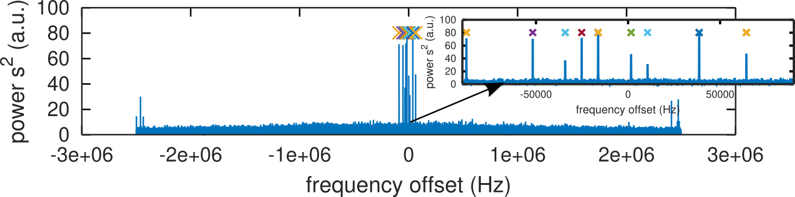
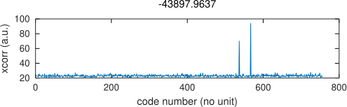
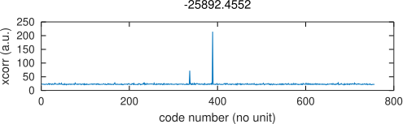
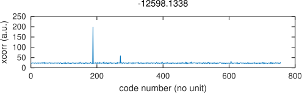
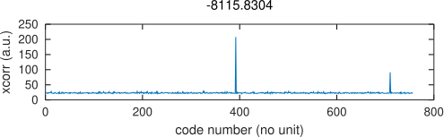
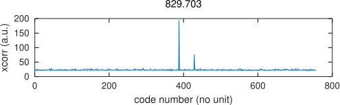
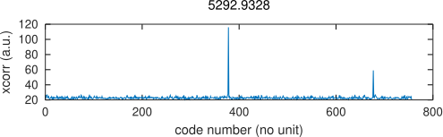
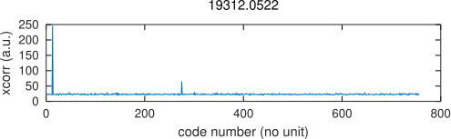
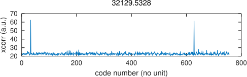

# Code reverse engineering
We know from the litterature that the MITREX code is generated from a 14-bit
long Linear Feedback Shift Register (LFSR) truncated to 10000 bits. It seems
most obvious to search from all possible 14-bit long LFSRs (there are only 756
possible options). Since the all-0s state is forbidden (since (XOR(0,0)=0, the
code would remain at 0 in all subsequent states), we might consider the initial
state of all 1s.

Indeed all received signal offsets as detected by squaring the signal to get
rid of the BPSK modulation is associated, after compensation of the frequency
offset, to one (or more) code. Only a subset of all possible codes are actually 
used so that visible interferences do not impact SATRE codes. In the charts below,
all possible codes are correlated for each possible frequency offset as indicated
and peaks are visible for the code associated with each station. Notice how the
implementation stores the FFT of each code and performs the correlation as
matrix product of the FFT of the frequency shifted signal: matrix operation greatly
improves speed over a loop in GNU/Octave or Matlab.

[0] P. Hartl, Present State of Long Distance Time Transfer via Satellites with Application
of the MITREX-MoDem, MILCOM 1986 - IEEE Military Communications Conference (5-9 Oct. 1986)

[1] K. Imamura, F. Takahashi, Frequency and Time Comparison -- Two Way Time Transfer
via a Geostationnary Satellite, pp.91-100 (March 1992) at http://www.nict.go.jp/publication/journal/39/001/Journal_Vol39_No001_pp091-100.pdf
